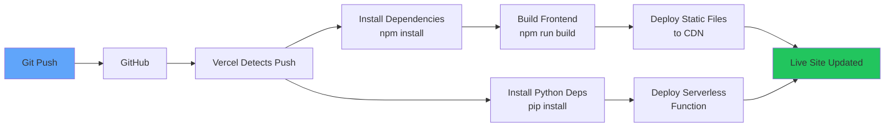
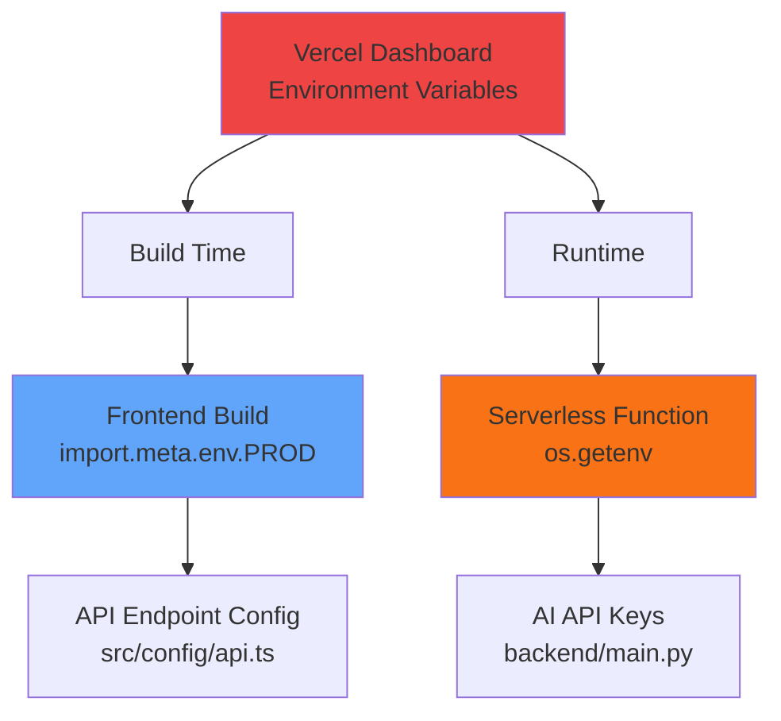
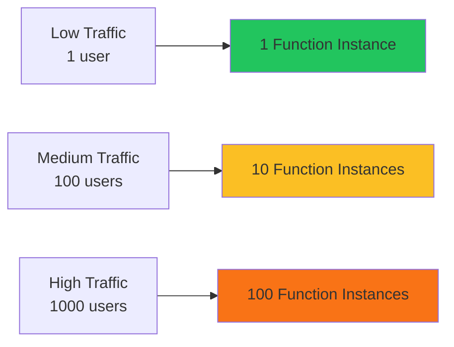

# Vercel Deployment Architecture

## 🏗️ Architecture Overview

```mermaid
graph TB
    subgraph "User's Browser"
        A[Portfolio Website]
        B[Chatbot Component]
    end
    
    subgraph "Vercel Edge Network - CDN"
        C[Static Assets<br/>HTML, CSS, JS, Images]
        D[API Routes<br/>/api/*]
    end
    
    subgraph "Vercel Serverless Functions"
        E[/api/index.py<br/>FastAPI Handler]
        F[backend/main.py<br/>Chat Logic]
    end
    
    subgraph "AI Providers"
        G[OpenRouter API<br/>Primary]
        H[Groq API<br/>Fallback]
    end
    
    subgraph "Environment Variables"
        I[OPENROUTER_API_KEY]
        J[GROK_API_KEY]
    end
    
    A -->|Loads| C
    B -->|POST /api/chat| D
    D -->|Invokes| E
    E -->|Imports| F
    F -->|Uses| I
    F -->|Uses| J
    F -->|Try Primary| G
    F -->|Fallback| H
    G -->|AI Response| F
    H -->|AI Response| F
    F -->|JSON Response| E
    E -->|Returns| D
    D -->|Response| B
    
    style A fill:#60a5fa
    style B fill:#fbbf24
    style C fill:#22c55e
    style D fill:#22c55e
    style E fill:#f97316
    style F fill:#f97316
    style G fill:#a855f7
    style H fill:#a855f7
    style I fill:#ef4444
    style J fill:#ef4444
```

## 📊 Request Flow

### 1. Static Content (Homepage, Projects, etc.)
```
User Browser → Vercel CDN → Static Files (dist/) → User Browser
```
- **Speed:** <100ms (cached globally)
- **Cost:** Free (Vercel CDN)

### 2. Chatbot API Request
```
User Types Message
    ↓
Frontend (ResumeChatBox.tsx)
    ↓
POST /api/chat
    ↓
Vercel Routes to /api/index.py
    ↓
Mangum Adapter
    ↓
FastAPI App (backend/main.py)
    ↓
Try OpenRouter API
    ↓ (if fails)
Try Groq API
    ↓ (if fails)
Static Fallback Response
    ↓
JSON Response with tokens
    ↓
Frontend Updates UI
```
- **Speed:** 1-3 seconds (AI processing)
- **Cost:** Free tier (OpenRouter + Groq)

## 🔧 Development vs Production

### Development (Local)
```
Frontend: http://localhost:8080
    ↓
API: http://localhost:8000/chat
    ↓
Python Backend (uvicorn)
```

### Production (Vercel)
```
Frontend: https://your-project.vercel.app
    ↓
API: https://your-project.vercel.app/api/chat
    ↓
Serverless Function (auto-scaled)
```

**Key Difference:** 
- Local: Separate servers (frontend + backend)
- Production: Single domain, serverless backend

## 📁 File Structure on Vercel

```
your-project.vercel.app/
├── / (root)
│   ├── index.html
│   ├── assets/
│   │   ├── index-[hash].js
│   │   ├── index-[hash].css
│   │   └── images/
│   └── ... (all static files from dist/)
│
└── /api/
    └── index.py (serverless function)
        └── imports backend/main.py
```

## 🚀 Deployment Pipeline



**Timeline:**
1. Git push: Instant
2. Vercel detection: ~5 seconds
3. Build process: ~2 minutes
4. Deployment: ~30 seconds
5. **Total:** ~2-3 minutes

## 🔐 Environment Variables Flow



## 💰 Cost Breakdown (Free Tier)

| Service | Free Tier | Your Usage | Cost |
|---------|-----------|------------|------|
| **Vercel Hosting** | 100GB bandwidth/month | ~1-5GB | $0 |
| **Vercel Functions** | 100GB-hours/month | ~1-10GB-hours | $0 |
| **OpenRouter** | Free tier available | Primary API | $0 |
| **Groq** | Free tier available | Fallback API | $0 |
| **GitHub** | Unlimited public repos | 1 repo | $0 |
| **Total** | - | - | **$0/month** |

## 🌍 Global Distribution

```
User in New York → Vercel Edge (New York)
User in London → Vercel Edge (London)
User in Tokyo → Vercel Edge (Tokyo)
```

**Benefits:**
- ⚡ Low latency worldwide
- 🌐 Automatic geographic routing
- 📈 Auto-scaling
- 🔒 HTTPS by default

## 🔄 Auto-Scaling



**Serverless Benefits:**
- Pay only for actual usage
- Automatic scaling
- No server management
- Always available

## 📊 Monitoring Points

1. **Frontend Performance**
   - Vercel Analytics
   - Browser DevTools

2. **API Performance**
   - Vercel Functions Logs
   - Response times

3. **AI API Usage**
   - OpenRouter Dashboard
   - Groq Console

4. **Errors**
   - Vercel Logs
   - Browser Console

---

## 🎯 Key Takeaways

1. **Serverless Architecture:** No servers to manage
2. **Global CDN:** Fast worldwide
3. **Auto-Scaling:** Handles traffic spikes
4. **Zero Cost:** Free tier sufficient
5. **Auto-Deploy:** Git push = live update
6. **Full Stack:** Frontend + Backend in one place

---

**This architecture ensures your portfolio is:**
- ⚡ Fast (CDN + serverless)
- 🌍 Global (edge network)
- 💰 Free (generous free tiers)
- 🔒 Secure (HTTPS, env vars)
- 🚀 Scalable (auto-scaling)
